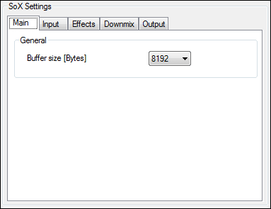
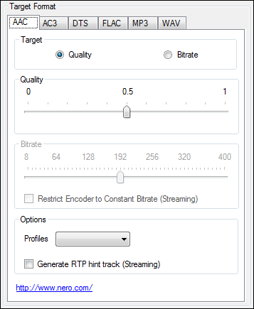

# BDAudioConverterGUI

A GUI for Eac3to, SoX and other tools for converting audio files. I wrote this little tool a few years ago.
Code is a mess, but it still works. Feel free to use it :-).

* [Readme](BDAudioConverterGUI/Readme.txt)
* [Changelog](BDAudioConverterGUI/Changelog.txt)


   

## Getting Started

This repository delivers only the code. To get the compiled GUI working you have to use the following directory-tree:
```
BDAudioConverterGUI/
├── aften/
│   └── aften.exe
│
├── dcaenc/
│   └── dcaenc.exe
│
├── eac3to/
│   ├── eac3to.exe
│   └── other necessary files...
│
├── lame/
│   ├── lame.exe
│   └── other necessary files...
│
├── neroaacenc/
│   └── neroAacEnc.exe
│
├── sox/
│   ├── sox.exe
│   └── other necessary files...
│
├── BDAudioConverterGUI.exe
└── MediaInfo.dll
```

## License

Licensed under [GNU GPL v3.0](https://www.gnu.org/licenses/gpl-3.0.en.html)
